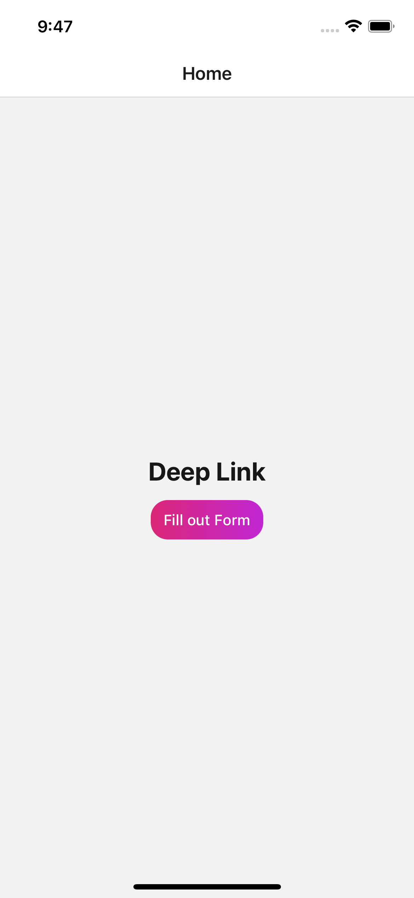
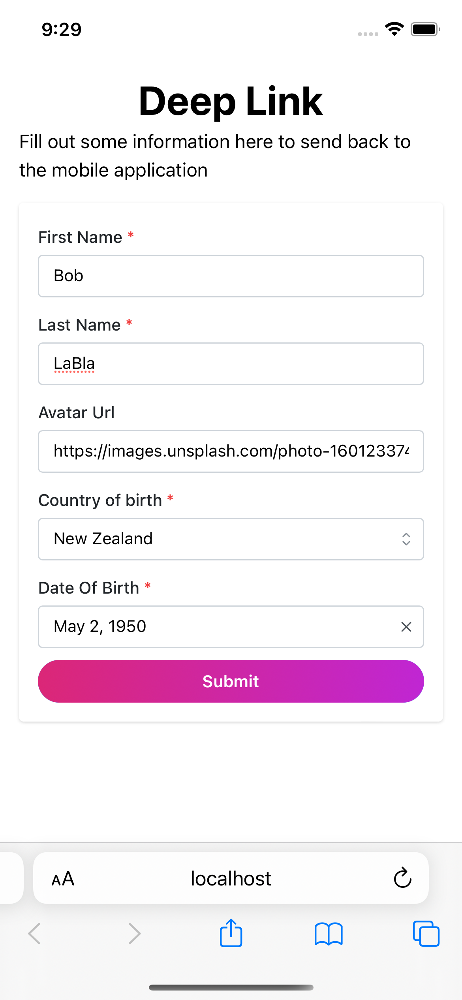
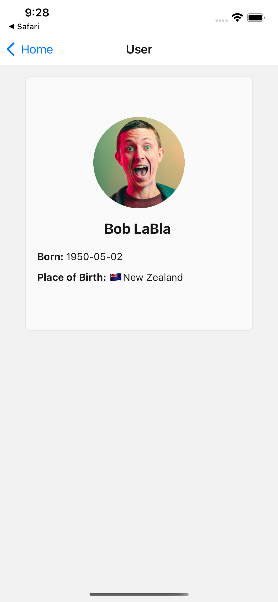

<p align="center">
  <h1 align="center">Deep Link</h1>
  <h4 align="center">This project demonstrates how to use deep links and pass information between an app and a web page.</h4>
</p>

<p align="center">
  
  
  
</p>


## Running mobile and web apps in dev mode 
```bash
npm run dev 
```

## Building mobile app for iOS
```bash
npm run build:mobile
```

## Building web app
```bash
npm run build:web
```

## Building mobile and web 
```bash
npm run build
```


## TODO:
- [ ] Add tests
- [ ] Add pre commit hook that runs lint-staged
- [ ] Add prepare hook that runs conventional commits
- [ ] Add pre push hook that runs tests
- [ ] Set up CI to run tests
- [ ] Add dotenv to handle env vars for mobile 
- [ ] Sync web and mobile app styles
  - [ ] Setup storybook components for both web and mobile
  - [ ] Create shared pallette lib for web and mobile

This project is scaffolded and has tooling provided by [nx](https://nx.dev/) to help run and generate files.
